# 🏨 Hotel Management System

This Hotel Management System is a Java-based desktop application backed by MySQL. It allows seamless operations for hotel administration, staff, and reception with features like employee/room/driver management, real-time room status updates, customer handling, and billing.

---

## 🚀 Features

- Admin and Reception Login
- Add/View Employees, Rooms, and Drivers
- Room Booking & Checkout
- Customer and Manager Info Tracking
- Status and Room Updates
- Pickup Services and Search Filters

---

## 📸 Screenshots

### 1. Home Page  
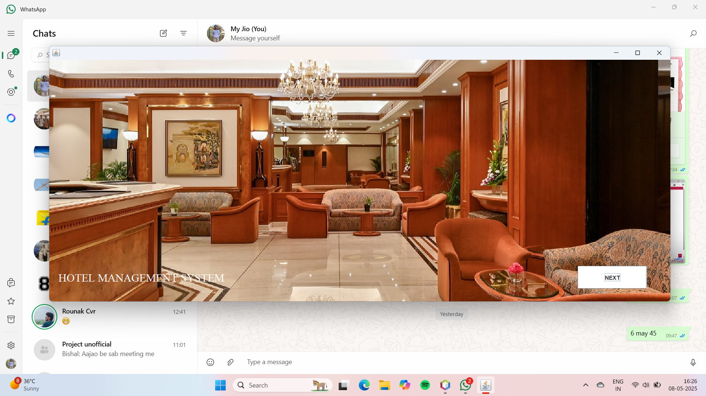

### 2. Login Page  
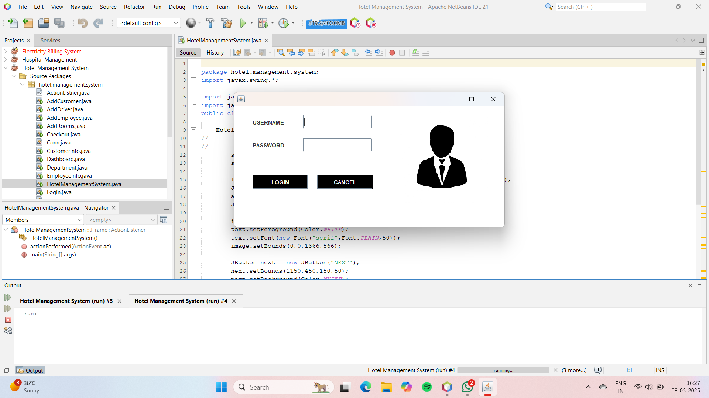

### 3. Dashboard  
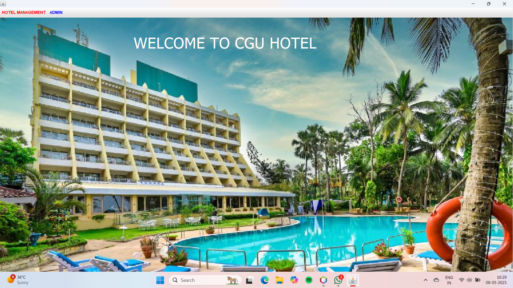

### 4. Admin - Add Employee  
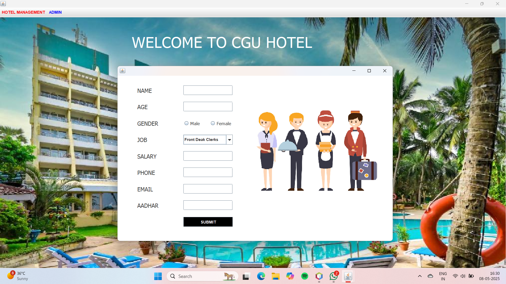

### 5. Admin - Add Rooms  
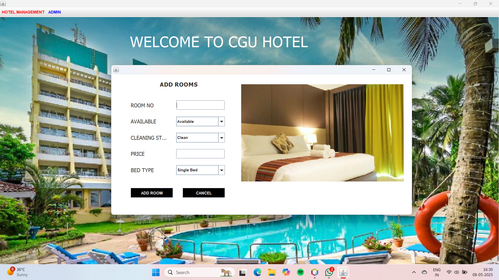

### 6. Admin - Add Drivers  
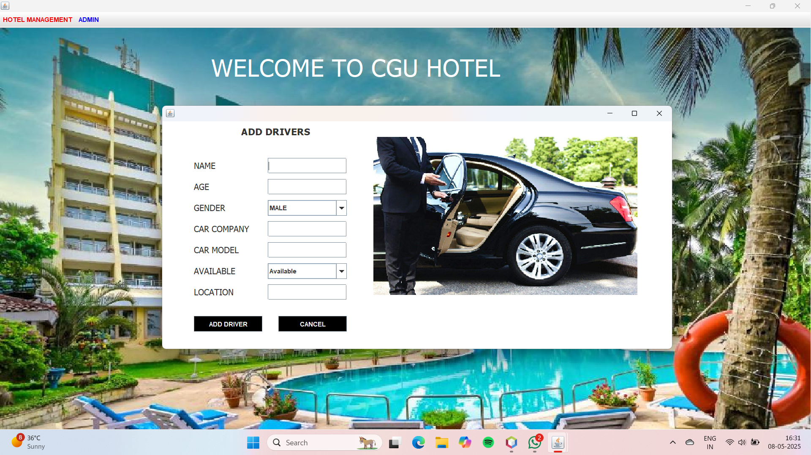

### 7. Reception - New Customer Form  
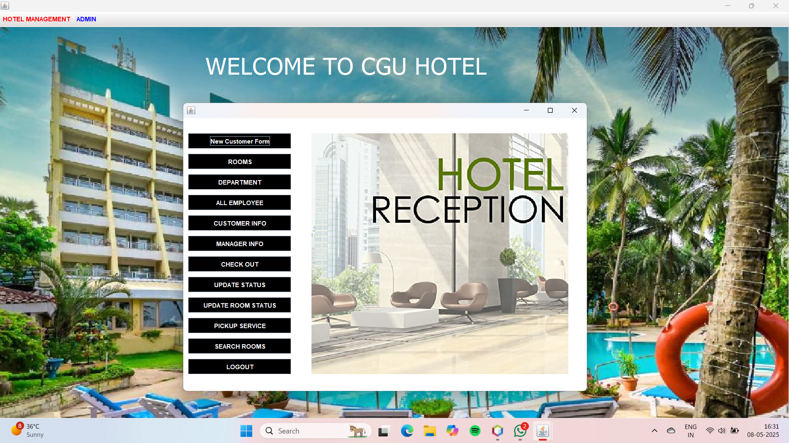

### 8. Rooms Overview  
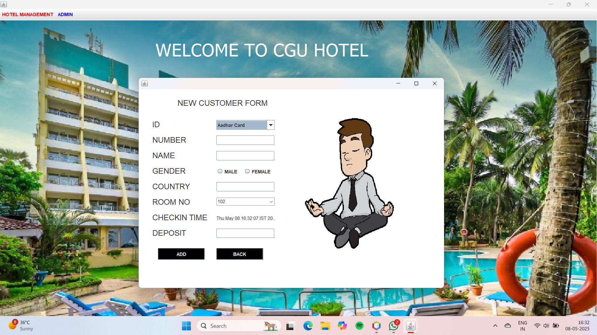

### 9. Department Info  
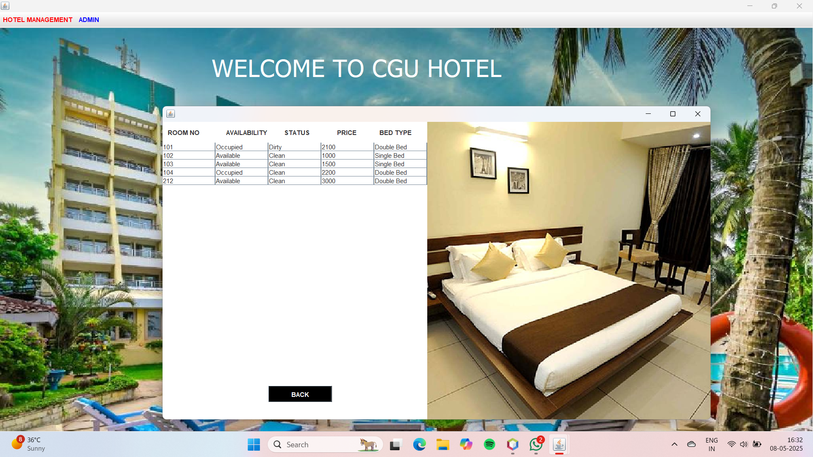

### 10. All Employees  
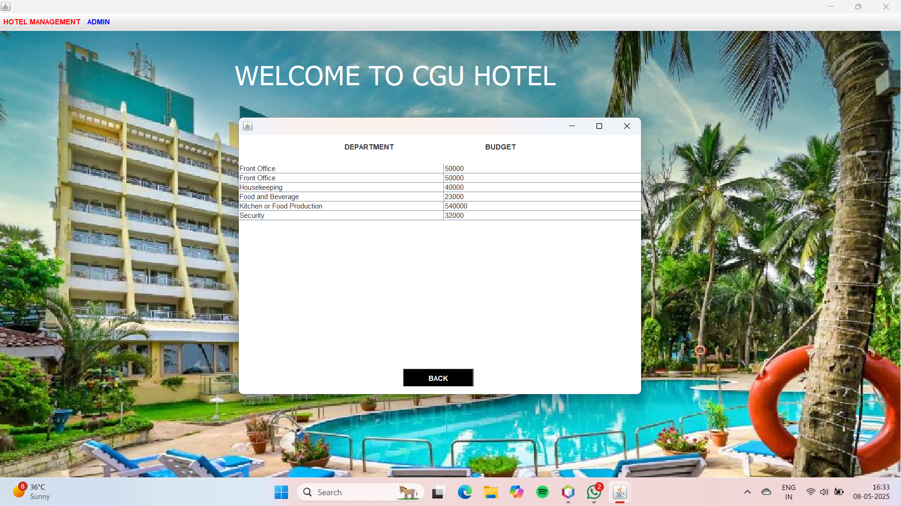

### 11. Customer Information  
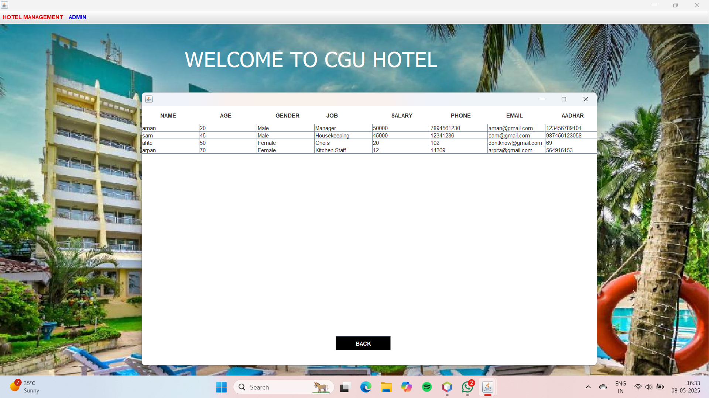

### 12. Manager Information  

### 13. Checkout  
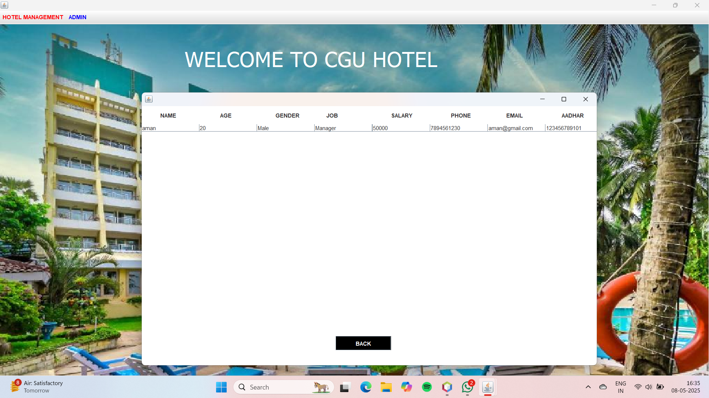

### 14. Update Status  
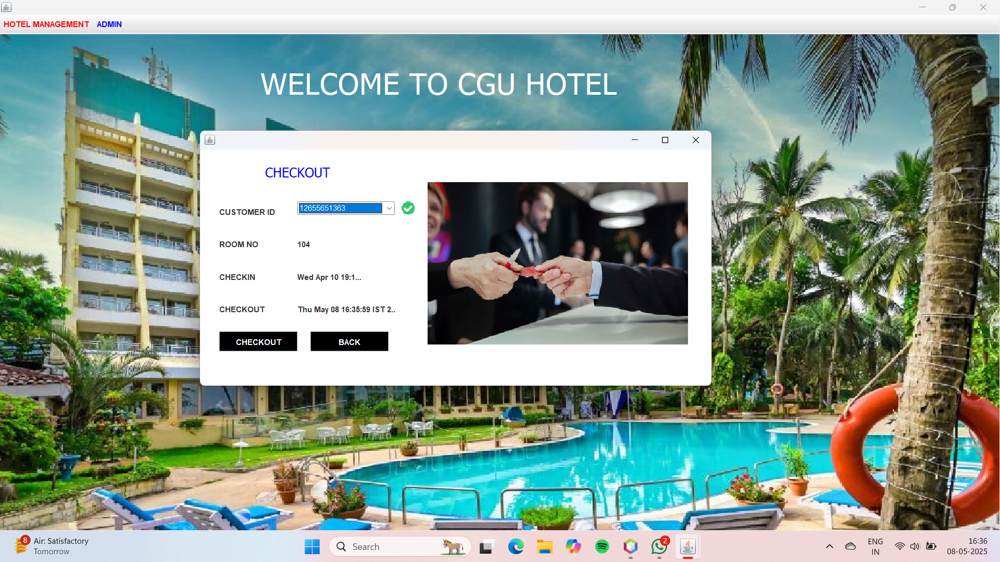

### 15. Update Room Status  
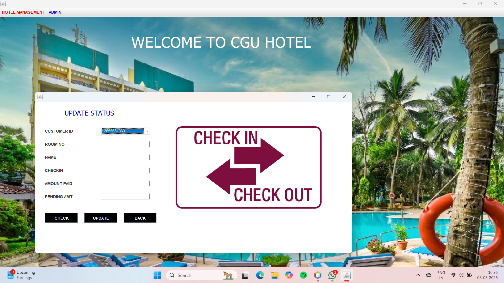

### 16. Pickup Service  
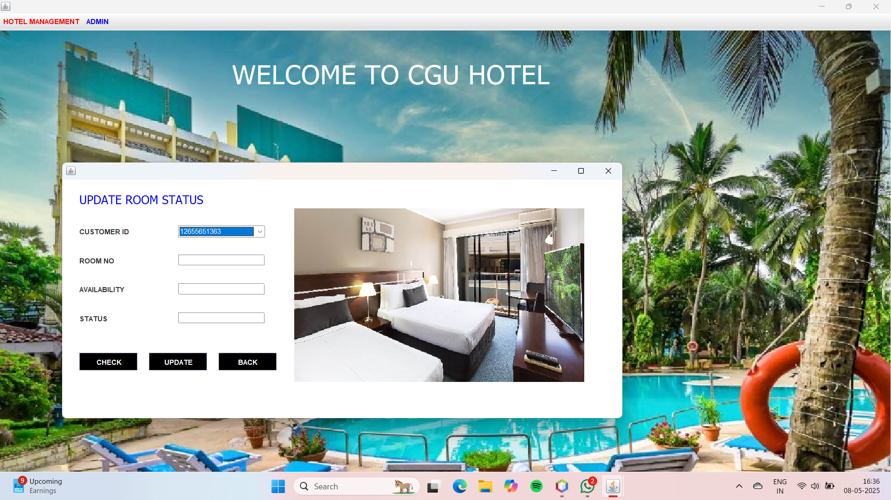

### 17. Search Rooms  
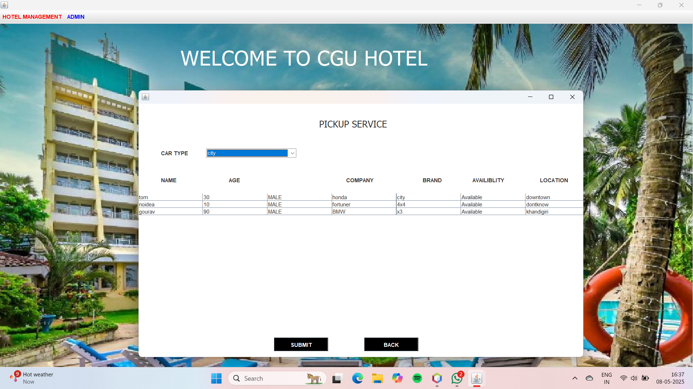

### 18. Final Status  

---

## 🛠️ Tech Stack

- **Language:** Java (Swing & AWT)
- **Database:** MySQL
- **IDE Used:** IntelliJ IDEA / Eclipse
- **Connectivity:** JDBC

---

## 📂 IDE- Apache NetBeans IDE 21

